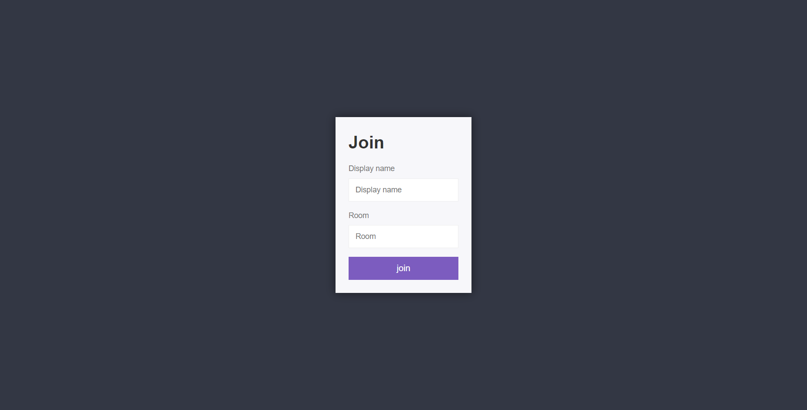

# Project Title

Speak

## Project Description

Live Chat Application using Nodejs and Socket.io

## Table of Contents

- [Installation](#installation)
- [Usage](#usage)
- [URL](#url)
- [Technologies](#technologies)
- [Author](#author)

## Installation

1- Clone the repository:
git clone https://github.com/Abdalrzakalsouki/Speak.git

2- Navigate to project directory:
cd speak

3- Install dependencies:
npm install

4- Run the project:
npm run dev

## Usage

## url

Live Site URL: (https://speak-two.vercel.app)

## Technologies

- Nodejs
- Socket.io
- Javascript
- HTML5
- CSS3
- NPM Libraries

## author

- LinkedIn - [@abdulrazzakalsssouki](https://www.linkedin.com/in/abdulrazzakalsssouki)
